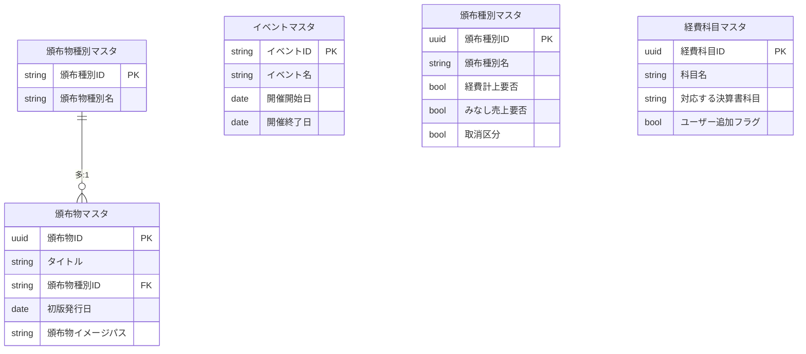
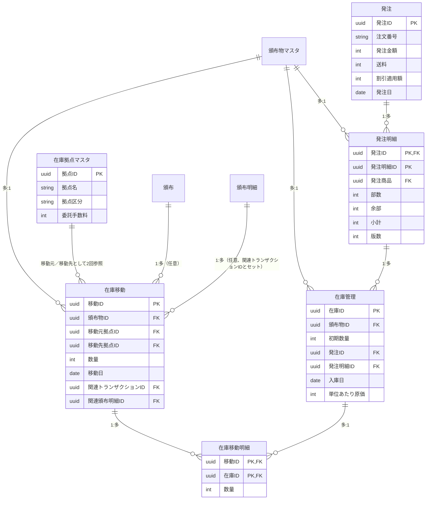
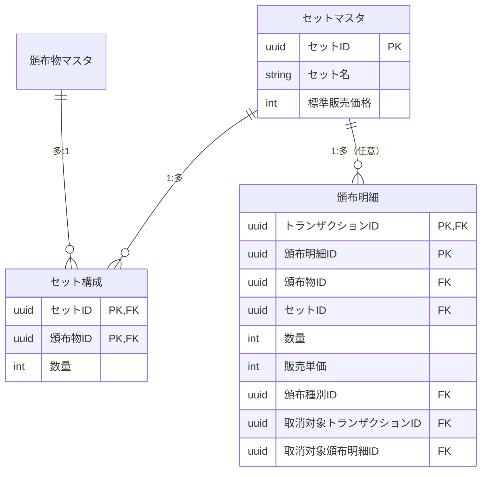
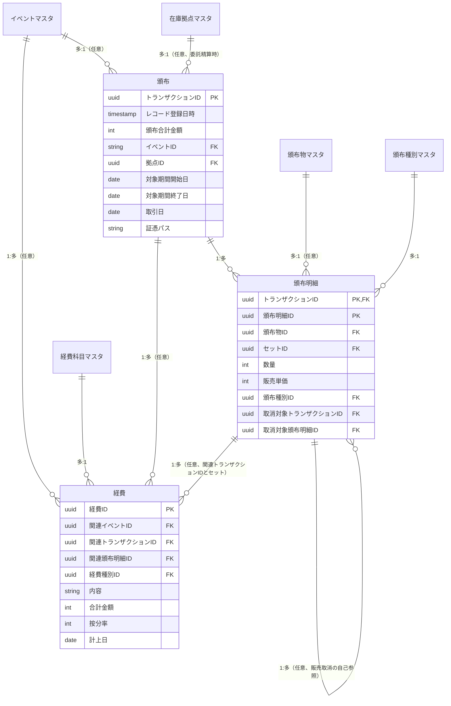
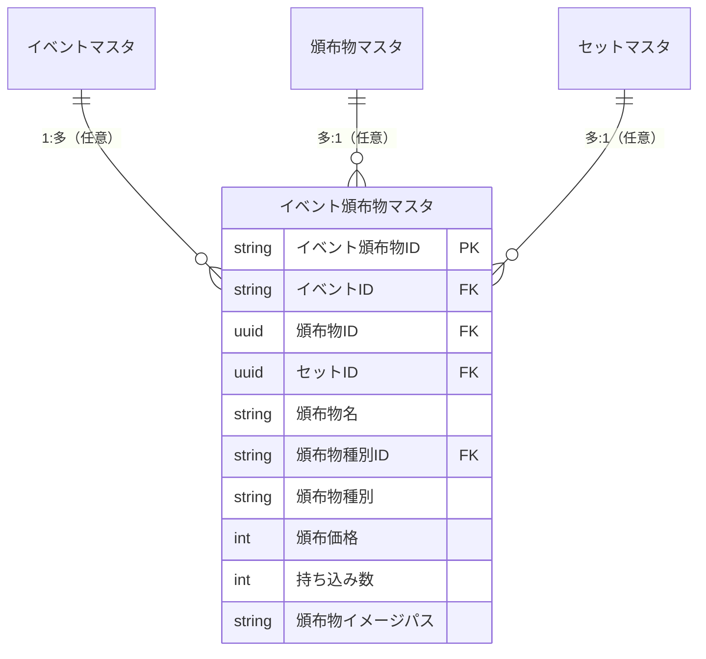

# データモデル図（確定版）

最終更新：2026-09-08（第1回～第3回ブラッシュアップ＋シナリオ検証後の修正＋テスト結果レビュー対応＋C-08/C-09対応＋A-12対応＋A-10横展開＋E-09対応＋B-10対応〔経費への按分率列追加、頒布種別IDを頒布明細へ統合し頒布形態を廃止、削除時参照整合性・複合主キーのFirestore実装方針・販売取消の自己参照を明記、在庫移動への関連頒布明細ID追加〕を反映）

## マスタ系

## 発注・在庫系

先入先出法の評価は、在庫移動明細をロット（在庫ID）・拠点ごとに集計するだけで求まる（詳細は`検証_2026-09-08_トランザクションフロー.md`を参照）。

## セット系

## 頒布・経費系

## レジ連携系

イベントアプリ（レジ）のオフライン利用・表示速度のため、頒布物名・頒布物種別・イメージパスをあえて非正規化して保持する（第3回）。`頒布物ID`と`セットID`は頒布明細と同じく排他的な任意項目。

## 過去の構成（参考）
- 委託先マスタ（廃止・在庫拠点マスタへ統合、第2回）
- 在庫（→在庫管理に改称、第2回）
- 商品マスタ・商品構成（→セットマスタ・セット構成に改称・再設計、第2回）
- 頒布明細の主キーは当初`(トランザクションID, 頒布物ID)`だったが、セットを1行で登録できるよう`(トランザクションID, 頒布明細ID)`に変更（第3回）
- 在庫移動の`関連在庫ID`（新規入庫時のみのロット紐付け）は、あらゆる移動種別でロット内訳を持てる`在庫移動明細`に統合し廃止（先入先出法の検証後の修正）

変更前の完全な姿は各`提案_2026-09-06_第N回.md`・`検証_2026-09-08_トランザクションフロー.md`を参照。
