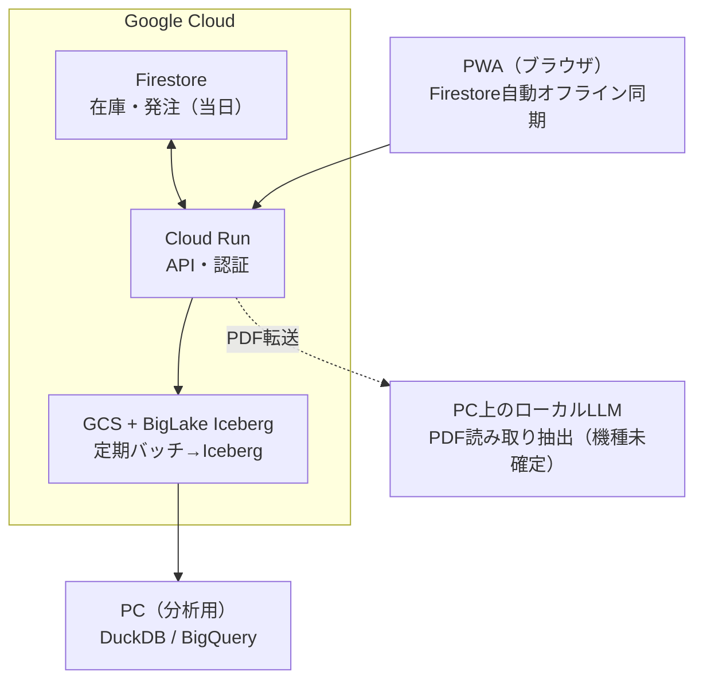
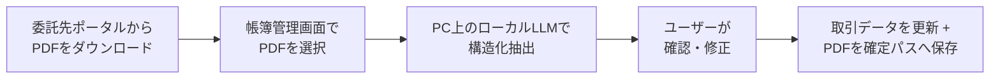
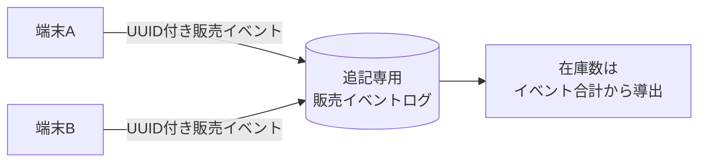
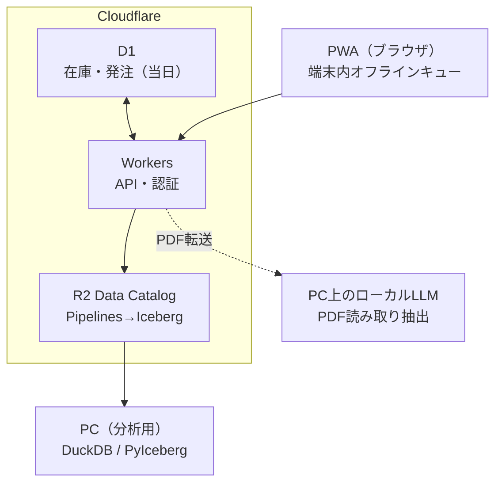

# 構成図

## 採用構成（パターンB：Google Cloud）

### コンポーネントの役割

| コンポーネント | 役割 | 補足 |
|---|---|---|
| PWA | イベント販売・発注入力のフロントエンド | Firestore Web SDKの`persistentLocalCache`でオフライン読み書きを自動化 |
| Cloud Run | REST API、Firebase IDトークンの検証 | シークレットはSecret Managerから注入、クライアントには渡さない |
| Firestore | 当日の在庫・発注・販売イベント（当日運用データ） | 複数端末・複数タブでも自動でキュー・再送 |
| GCS + BigLake Iceberg | レイクハウス本体。構造化データ（Iceberg）と非構造化データ（PDF等）を同一ストレージに保持 | BigQuery経由でDML操作可能 |
| 定期バッチ（Cloud Scheduler） | Firestoreの新規イベントをBigQuery DML `INSERT`でBigLake Icebergへ反映 | ドキュメントIDをUUIDにして冪等性を確保 |
| ローカルLLM（PC） | 委託先PDFの構造化抽出 | 個人情報を含むため外部送信を避ける方針。機種は未確定 |
| PC（分析用） | 確定申告用の収支集計 | DuckDBまたはBigQueryコンソールから直接分析 |

## 書類取り込みパイプライン

PDFファイル自体はGCSにそのまま蓄積される（非構造化データ）。AIに読ませる工程だけをローカルに寄せている点がポイント。

## 販売イベントの整合性設計

複数端末での同時販売・オフライン時のバッチ送信を許容するため、在庫は共有の可変カウンタとして持たない。

この設計により、複数端末・オフライン・後からのバッチ同期のいずれでも売上記録の消失（lost update）や二重計上が起きない。詳細は[検討の記録.md](検討の記録.md)の「設計原則」を参照。

## 参考：比較検討したもう一つの候補（パターンA：Cloudflare構成）

パターンBと最後まで比較した構成。実装コストの観点（PWAのオフライン対応を自前実装する必要がある）でBを採用したが、月額はAの方がやや安くなる可能性がある。詳細は[検討の記録.md](検討の記録.md)を参照。

